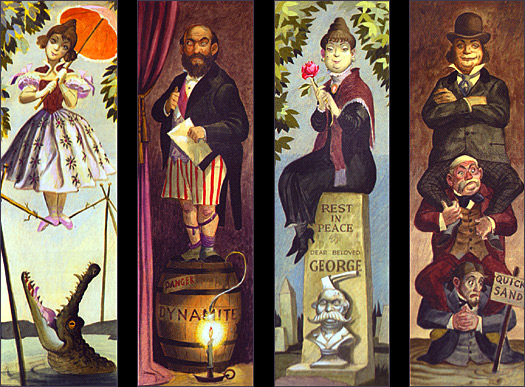

First off...here are two things I looked up today:

  
<strong>What are the paintings in the stretching gallery of Disneyland's Haunted Mansion?</strong>

  <figure>
    <figcaption>From <a href="http://www.doombuggies.com/secrets_foyer.php">Secrets of the Haunted Mansion: The Foyer and Gallery</a></figcaption>
  </figure>

  
<strong>Who was Grace Hopper?</strong>

  
<a href="https://en.wikipedia.org/wiki/Grace_Hopper">Wikipedia</a>

  

What made me look up Grace Hopper? I requested basic information from the [Grace Hopper Academy](http://gracehopper.com/), a immersive programming school in NYC exclusively for women. The school sent their Resource Guide, which helps students prep for the program. Very interesting path, a little different from what we used at Portland Code School...and all the resources they recommend for getting started are free, except for Code School courses (which aren't that expensive).

And in other news, I've started exploring HTML5 Canvas. Here are some resources I'm using:

* <cite>Mobile HTML</cite>, Estelle Weyl.
* <a href="http://chimera.labs.oreilly.com/books/1234000001654/index.html"><cite>HTML5 Canvas</cite></a>, Steve Fulton and Jeff Fulton.
* [Sitepoint Tutorial](http://www.sitepoint.com/html5-canvas-tutorial-introduction/)

